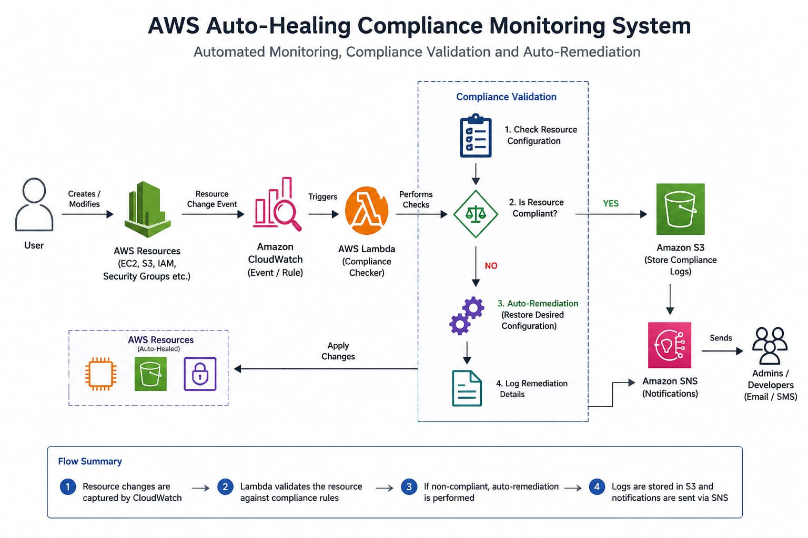
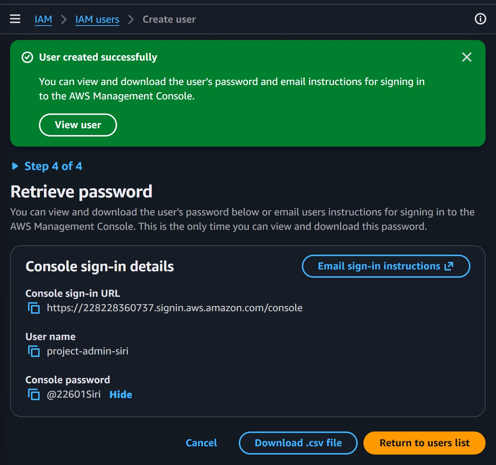
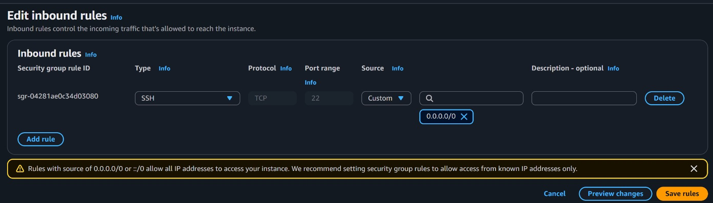
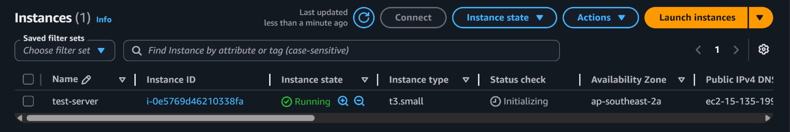
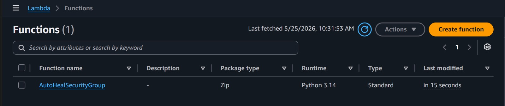
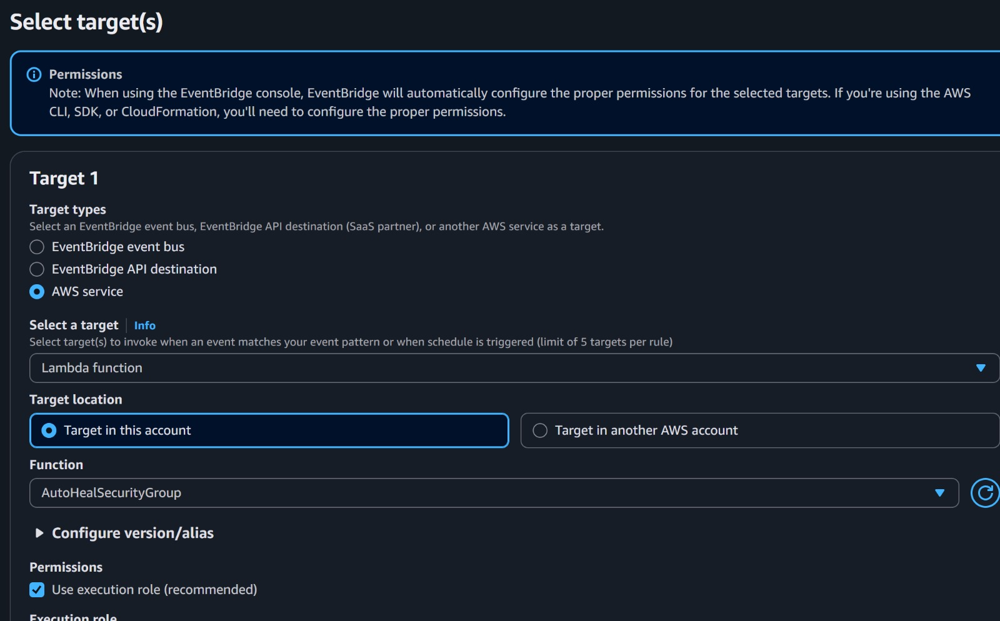
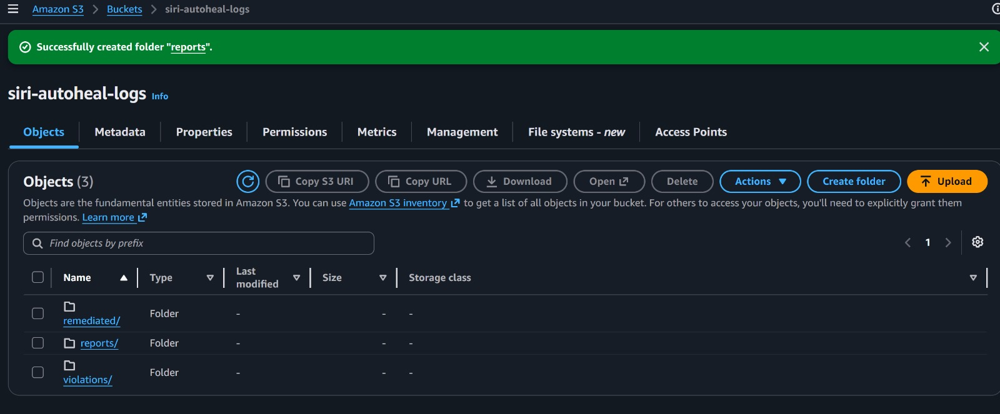
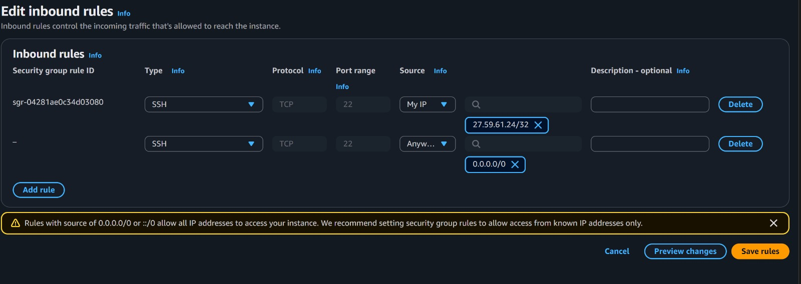

# AWS Auto-Healing Compliance Monitoring System

A serverless AWS security automation platform that continuously monitors infrastructure changes, validates compliance policies, automatically remediates security violations, and delivers real-time alerts without manual intervention.

---

## Problem Statement

Manual monitoring of AWS environments is time-consuming and prone to human error. Misconfigured resources, particularly overly permissive security groups, can expose infrastructure to significant security risks.

This project demonstrates how AWS-native services can automatically detect, validate, remediate, and report compliance violations in real time.

---

## Architecture



---

## Platform Demonstration


The demonstration showcases the complete security lifecycle:

1. A non-compliant security group rule is introduced.
2. CloudWatch detects the configuration change.
3. Lambda validates the resource against compliance policies.
4. The violating rule is automatically removed.
5. SNS notifications are generated.
6. Compliance logs are stored for auditing purposes.

---

## AWS Services Used

| Service           | Purpose                                      |
| ----------------- | -------------------------------------------- |
| AWS Lambda        | Compliance validation and remediation engine |
| Amazon CloudWatch | Event detection and monitoring               |
| Amazon SNS        | Security alert notifications                 |
| Amazon S3         | Compliance log storage                       |
| AWS IAM           | Access and permission management             |
| Amazon EC2        | Security group monitoring target             |

---

## Key Features

* Real-time infrastructure monitoring
* Automated compliance validation
* Auto-healing remediation workflows
* Event-driven serverless architecture
* Security group enforcement
* SNS-based alerting
* Compliance logging and audit visibility
* Zero manual intervention after detection

---

## Workflow

1. Users create or modify AWS resources.
2. CloudWatch detects infrastructure changes.
3. Event rules invoke the Lambda compliance checker.
4. Compliance policies are evaluated.
5. Security violations are identified.
6. Auto-remediation actions are executed.
7. Notifications are delivered through SNS.
8. Compliance logs are archived for auditing.

---

## Compliance Validation Logic

The Lambda function validates resources against predefined security policies, including:

* Unauthorized inbound IP ranges
* Security group compliance checks
* Resource configuration deviations
* Infrastructure security standards
* Policy enforcement requirements

If a violation is detected, the system automatically initiates remediation procedures to restore the desired configuration state.

---

## Remediation Engine

The auto-remediation engine automatically revokes unrestricted inbound access (`0.0.0.0/0` and `::/0`) to enforce security group compliance.

```python
if ip_range.get('CidrIp') == '0.0.0.0/0':
    ec2.revoke_security_group_ingress(
        GroupId=group_id,
        IpPermissions=[permission]
    )
    print("Removed IPv4 open rule")

if ipv6_range.get('CidrIpv6') == '::/0':
    ec2.revoke_security_group_ingress(
        GroupId=group_id,
        IpPermissions=[permission]
    )
    print("Removed IPv6 open rule")
```

This remediation logic ensures that overly permissive security group rules are automatically removed whenever non-compliant changes are detected.

---

## Implementation Evidence

### Architecture Overview


### CloudWatch Event Detection



### Lambda Compliance Engine



### Auto-Remediation Execution



### SNS Security Notifications



### Compliance Log Storage



### CloudWatch Execution Logs



### Final Compliance State



---

## Project Structure

```text
Auto_healing/
├── screenshots/
│   ├── 01-architecture-diagram.jpg
│   ├── 02-cloudwatch-event-rule.jpg
│   ├── 03-lambda-compliance-checker.jpg
│   ├── 04-auto-remediation-execution.jpg
│   ├── 05-sns-alert-notification.jpg
│   ├── 06-s3-compliance-logs.jpg
│   ├── 07-cloudwatch-logs.jpg
│   ├── 08-final-compliance-state.jpg
│   └── auto-healing-demo.gif
├── README.md
└── Lambda remediation code
```

---

## Outcomes

* Demonstrated automated detection of non-compliant infrastructure changes.
* Implemented real-time security group validation.
* Successfully revoked unrestricted SSH access automatically.
* Delivered security notifications through SNS.
* Preserved compliance evidence using centralized logs.
* Eliminated manual remediation activities.

---

## Status

**Completed as a hands-on AWS security automation and auto-remediation implementation project.**

---

## Author

**Siri**

This project demonstrates practical implementation of event-driven security enforcement using AWS-native services, focusing on automated remediation and operational security visibility.
